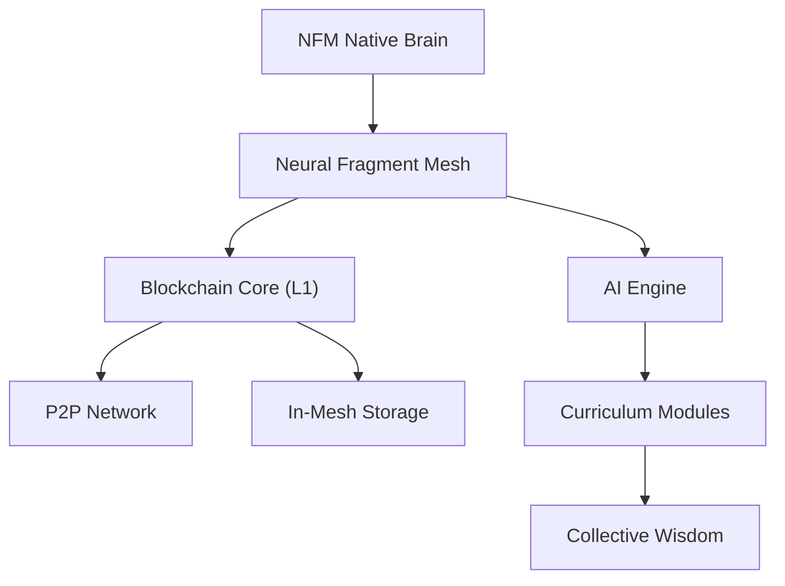

# 🧠 NFM (Neural Fragment Mesh)


[](https://opensource.org/licenses/MIT)
[](https://www.rust-lang.org/)
[]()
[]()

**Neural Fragment Mesh (NFM)** is a Sovereign AI-Blockchain Ecosystem designed as a decentralized foundation for collective intelligence. Unlike traditional blockchains, NFM is built from the ground up to integrate AI models directly into its consensus and reward mechanisms.

---

## 🏛️ Core Vision

NFM aims to solve the "Isolated AI" problem by creating a shared, immutable mesh where AI fragments can be trained, verified, and rewarded through a sovereign Layer 1 blockchain. This mesh is designed for:
- **Collective Learning**: Shared "Native Brain" curricula for decentralized intelligence.
- **Sovereign Performance**: High-efficiency Rust-based blockchain core.
- **AI-Native Governance**: Protocol rules driven by both biological and digital consensus.

## 🛠️ Technology Stack

| Component | Technology | Description |
| :--- | :--- | :--- |
| **Blockchain Core** | [Rust](https://www.rust-lang.org/) | Memory-safe, high-performance L1 node. |
| **P2P Layer** | Gossip Protocol | Robust propagation & dynamic discovery. |
| **Database** | [Sled DB](https://github.com/spacejam/sled) | Embedded KV store for consensus state. |
| **UI Shell** | [Vite](https://vitejs.dev/) + [React](https://react.dev/) | High-speed, modern block explorer. |
| **AI Runtime** | Custom WASM/Native | Integrated model execution & sharding. |

## 🏗️ Architecture Overview



## 🚀 Getting Started

### Prerequisites
- **Rust**: [Installation Guide](https://rustup.rs/) (v1.75+)
- **Node.js**: [Download](https://nodejs.org/) (v18+)

### Launching the Node
Clone the repository and run the node using the automated script:
```bash
git clone https://github.com/dandi-apriadi/NFM.git
cd NFM/apps/node-runner
.\run.ps1
```

### Direct Core Run (from repo root)
If you prefer running the blockchain core directly, use one of these commands from `NFM` root:
```powershell
cargo run --manifest-path core/blockchain/Cargo.toml --release
```

Or use helper script:
```powershell
.\scripts\run_blockchain.ps1
```

Optional ports:
```powershell
.\scripts\run_blockchain.ps1 -ApiPort 3001 -P2PPort 9001
```

### API Health Check (fail-fast)
After node startup, validate required API endpoints:
```powershell
.\scripts\blockchain_healthcheck.ps1
```

Custom timeout/base URL:
```powershell
.\scripts\blockchain_healthcheck.ps1 -BaseUrl http://127.0.0.1:3001 -TimeoutSec 45
```

### One-Command Bootstrap (node + health check)
Start blockchain node and block until API endpoints are healthy:
```powershell
.\scripts\bootstrap_stack.ps1
```

Start explorer dev server after health check succeeds:
```powershell
.\scripts\bootstrap_stack.ps1 -StartExplorer
```
If `apps/nfm-explorer/node_modules` is missing, the script will run `npm install` automatically before starting explorer.

Run quick verification and auto-stop node after check:
```powershell
.\scripts\bootstrap_stack.ps1 -StopNodeAfterCheck
```

### End-to-End Integration Smoke
Run full integration smoke in one command (start node -> health check -> app actions smoke -> cleanup):
```powershell
.\scripts\integration_e2e_smoke.ps1
```

Increase smoke iteration count:
```powershell
.\scripts\integration_e2e_smoke.ps1 -SmokeRepeat 2
```

Write smoke summary artifacts to a custom folder:
```powershell
.\scripts\integration_e2e_smoke.ps1 -ArtifactDir artifacts/integration-smoke
```

### CI Integration Smoke
GitHub Actions workflow is available at:
`.github/workflows/integration-smoke.yml`

It runs on Windows and executes the same automation flow:
- start node
- health-check endpoints
- app actions smoke
- cleanup node process
- upload run artifacts (`artifacts/integration-smoke/summary.json` and `summary.txt`)

### Opening the Explorer
```bash
cd ../nfm-explorer
npm install
npm run dev
```

## 📜 Documentation Guide

| File | Description |
| :--- | :--- |
| [blueprint.txt](./blueprint.txt) | High-level engineering standards. |
| [docs/sovereign_chain_design.md](./docs/sovereign_chain_design.md) | L1 Architecture Specs. |
| [docs/security_audit.md](./docs/security_audit.md) | PQC & Bio-ZKP security. |
| [docs/implementation_roadmap.md](./docs/implementation_roadmap.md) | Phase-by-phase roadmap. |

## 🤝 Contributing

We welcome scientists, developers, and AI enthusiasts! Please read our [CONTRIBUTING.md](./CONTRIBUTING.md) to get started.

## ⚖️ License

Project NFM is released under the **MIT License**. See [LICENSE](./LICENSE) for details.

---
*Maintained by [Dandi Apriadi](https://github.com/dandi-apriadi) & the NFM Foundation.*
